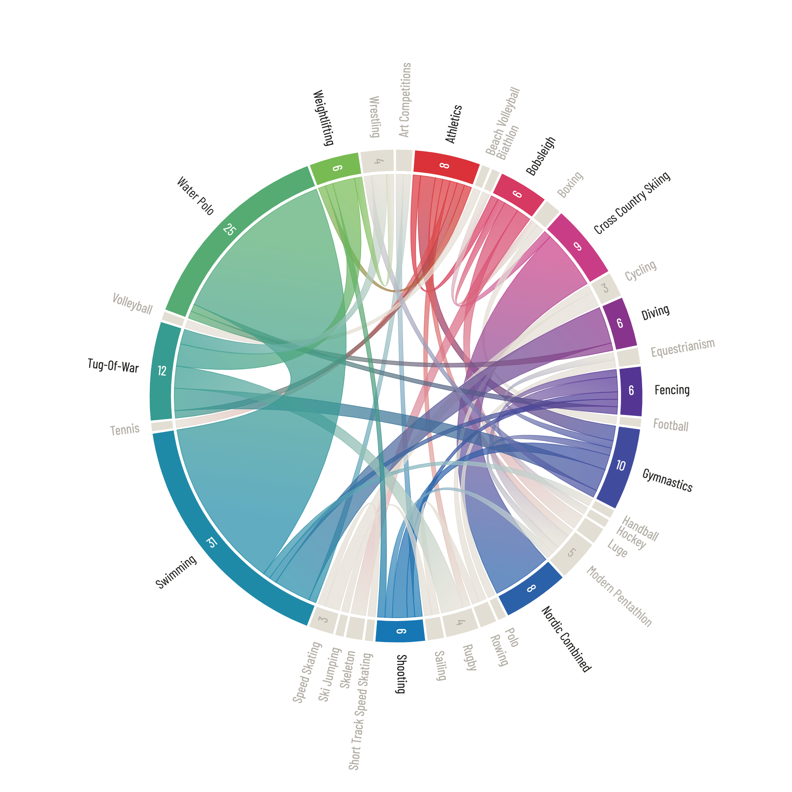

```{r include = FALSE}
# clear workspace
rm(list = ls(all = TRUE))

# year and week
yr <- 2021
wk <- 31

# chunk options
knitr::opts_chunk$set(
	eval = TRUE,
	echo = TRUE,
	include = TRUE,
	message = FALSE,
	warning = FALSE,
	fig.height = 10 / 1.618, # golden ratio
	fig.width = 10,
	dpi = 300,
	class.output="style-output",
  class.source="style-source"
)

# set options
options(
  digits = 3,
  rows.print = 15,
  cols.print = 4,
  paged.print = TRUE
)

# set locale
Sys.setlocale(category = "LC_ALL", locale = "en_US.UTF-8")

# helper functions
source(here::here("code", "helpers", "helpers.R"), local = knitr::knit_global())

# set ggplot theme
ggplot2::theme_set(hrbrthemes::theme_ipsum_rc())
```

# Result

```{r echo = FALSE}
knitr::include_graphics(here::here("result", glue::glue("{yr}_{wk}_1.png")))
```

# Setup

```{r}
pacman::p_load(
  chorddiag,
  circlize,
  glue,
  here,
  janitor,
  lubridate,
  magrittr,
  skimr,
  tidyverse
)
```

```{r include = FALSE}
library(rvest)

tt_info <- glue("https://github.com/rfordatascience/tidytuesday/tree/master/data/{yr}") %>% 
  read_html() %>% 
  html_element("table") %>% 
  html_table() %>% 
  filter(Week == wk)

tt_dictionary <- glue("https://github.com/rfordatascience/tidytuesday/blob/master/data/{yr}/{tt_info$Date}") %>% 
  read_html() %>% 
  html_element("table") %>% 
  html_table()
```

# Background

Background information: [Tidy Tuesday](`r glue("https://github.com/rfordatascience/tidytuesday/blob/master/data/{yr}/{tt_info$Date}")`)  
Data source: [Kaggle](https://www.kaggle.com/heesoo37/120-years-of-olympic-history-athletes-and-results)  

## Tidy Tuesday

```{r cols.print = 5}
tt_info
```


## Data Dictionary

```{r echo = FALSE, rows.print = 15}
tt_dictionary %>% select(-class)
```

# Raw Data

Get data and write to local file

```{r eval = FALSE}
# get data
olympics <- tidytuesdayR::tt_load(yr, week = wk) %>% 
  pluck("olympics")

regions <- tidytuesdayR::tt_load(yr, week = wk) %>% 
  pluck("regions")
  
# join on NOC region and write to local file 
write_csv(
  left_join(olympics, regions, by = c("noc" = "NOC")), 
  here("data", glue("data_{yr}_{wk}.csv")))
```

Read data from local file (`d_raw`) and create working copy (`d`)

```{r}
# raw data
d_raw <- read_csv(
  here("data", glue("data_{yr}_{wk}.csv")),
  col_types = cols(.default = "c"),
  na = c("NA", "NULL", "")
)
# working copy
d <- d_raw
```

# Inspection

```{r cols.print = 6, rows.print = 20}
d
```

```{r}
glimpse(d)
```

# Coercion

```{r}
d %<>% mutate(across(c("id", "age", "height", "weight", "year"),  ~ as.numeric(.x)))
```

# Exploration

## Athletes

```{r}
skim(d)
```

### Number of Athletes

```{r}
athlete_game <- d %>% 
  select(season, year, id) %>% 
  distinct() %>% 
  count(season, year)

ggplot(athlete_game, aes(x = year, y = n, color = season)) +
  geom_line() +
  labs(title = "Number of athletes at the Olympic games") +
  scale_y_continuous(name = "Participants") +
  scale_x_continuous(name = "Year")
```

### Sex of Athletes

```{r}
ggplot(count(d, year, sex), aes(x = as.factor(year), y = n, fill = sex)) +
  ggchicklet::geom_chicklet(position = position_fill(), radius = grid::unit(4, "pt")) +
  scale_y_continuous(labels = scales::percent) +
  scale_x_discrete(name = "Year") +
  labs(title = "Sex of Olympic athletes") +
  theme(
    axis.title.y = element_blank(),
    axis.text.x = element_text(size = 8, angle = 90),
    panel.grid.major = element_blank()
  )
```

### Age of Athletes

The youngest athlete —*`r filter(d, age == min(age, na.rm = TRUE)) %>% pull(name)`*— was only `r filter(d, age == min(age, na.rm = TRUE)) %>% pull(age)` years old.
```{r}
filter(d, age == min(age, na.rm = TRUE))
```

The oldest athlete —*`r filter(d, age == max(age, na.rm = TRUE)) %>% pull(name)`*— was `r filter(d, age == max(age, na.rm = TRUE)) %>% pull(age)` years old. He competed in the Art Competitions. 
```{r}
filter(d, age == max(age, na.rm = TRUE))
filter(d, sport != "Art Competitions") %>% filter(age == max(age, na.rm = TRUE))
```


```{r fig.height=18}
ggplot(d, aes(
  x = fct_rev(as.factor(sport)),
  y = age,
  fill = sport
)) +
  geom_violin(color = NA) +
  scale_fill_manual(values = pal_length(
    c(
      "#5f4690",
      "#1d6996",
      "#38a6a5",
      "#0f8554",
      "#73af48",
      "#edad08",
      "#e17c05",
      "#cc503e",
      "#94346e",
      "#6f4070"
    ),
    length(unique(d$sport))
  )) +
  coord_flip() +
  theme(legend.position = "none", axis.title.y = element_blank())
```


## Medalists

```{r}
medalists <- d %>% filter(!is.na(medal))
skim(medalists)
```

## Country Stats

### Total Medals

> Important note: this is just an approximation, because data are at athlete-level and *not* country-level. Thus, team sports are overrepresented, as a single winning event is assigned to multiple athletes.

Total number of medals per country from `r min(d$year)` to `r max(d$year)`
```{r cols.print = 5}
medal_count <- d %>% 
  group_by(region) %>% 
  count(medal) %>% 
  mutate(medal = str_to_lower(medal)) %>% 
  pivot_wider(names_from = medal, values_from = n) %>% 
  select(-`NA`) %>% 
  mutate(across(c("gold", "silver", "bronze"), ~replace_na(.x, 0))) %>% 
  mutate(total = gold + silver + bronze) %>% 
  select(region, gold, silver, bronze, total) %>% 
  ungroup()

medal_count
```
  

### Most Medals

Top 25 countries with most olympic medals  
*(not very informative —not taking number of athletes and times participated into account)*

```{r rows.print = 25, cols.print = 6}
medal_count %>% 
  slice_max(order_by = total, n = 25) %>% 
  rowid_to_column("rank")
```

### Times Participated  

Number of games in which countries have participated
```{r}
times_participated <- d %>% 
  select(region, games) %>% 
  distinct() %>% 
  group_by(region) %>% 
  count() %>% 
  arrange(desc(n)) %>% 
  rename(events = n)

times_participated
```

### Win Percentage

Number of medalists (any color) divided by number of participants per country per year
```{r rows.print = 25, cols.print = 10, digits = 1}
win_ratio <- left_join(
    count(d, region, year),
    count(medalists, region, year), 
    by = c("region", "year")) %>% 
  arrange(desc(year)) %>% 
  rename(participants = n.x, medalists = n.y) %>% 
  mutate(medalists = replace_na(medalists, 0)) %>%
  mutate(ratio = formattable::percent(medalists / participants))

win_ratio %>% 
  select(-medalists, -participants) %>% 
  pivot_wider(names_from = year, values_from = ratio)
```

### Highest Win Percentage

Country with highest medalists/participants ratio per year

```{r cols.print = 5, rows.print = 40}
win_ratio %>% group_by(year) %>% filter(ratio == max(ratio)) %>% select(year, region, ratio, medalists, participants)
```

### No Medals

`r medal_count %>% filter(total == 0) %>% nrow()` participating countries are still awaiting their first medal.
```{r}
medal_count %>% filter(total == 0) %>% pull(region)
```

### Summer/Winter

```{r fig.width = 4, fig.height=8}
both_seasons <-
  d %>% 
  select(region, season) %>% 
  distinct() %>% 
  group_by(region) %>% 
  count() %>% 
  filter(n == 2) %>% 
  pull(region)

n_winter_medals <- medalists %>% filter(season == "Winter") %>% count() %>% pull(n)
n_summer_medals <- medalists %>% filter(season == "Summer") %>% count() %>% pull(n) 

medals_season <- medalists %>% 
  filter(region %in% both_seasons) %>% 
  group_by(region, season) %>% 
  count() %>% 
  mutate(prop_total = case_when(
    season == "Winter" ~ n / n_winter_medals,
    season == "Summer" ~ n / n_summer_medals
  ))
```

## Sports Stats

Unique sports  
```{r}
sports_winter <- d %>% 
  filter(season == "Winter") %>% 
  pull(sport) %>% 
  unique() %>% 
  sort()
sports_winter

sports_summer <- d %>% 
  filter(season == "Summer") %>% 
  pull(sport) %>% 
  unique() %>% 
  sort()
sports_summer
```

Sports that have been part of both the summer and winter Olympics  
```{r}
base::intersect(sports_summer, sports_winter)
```

Times a sport has been on the Olympic schedule, incl. first and last year
```{r}
sport_stats <- d %>% group_by(sport) %>% summarise(
  first = min(year),
  last = max(year),
  times = n_unique(year)
)
```

Sports that have been on the Olympic schedule only once
```{r rows.print = 10}
sport_stats %>% 
  filter(times == 1) %>% 
  select(-times, -first) %>% 
  rename(year = last) %>% 
  arrange(desc(year))
```

Number of unique sports and events
```{r}
sport_count <- d %>% 
  select(year, season, sport) %>% 
  distinct() %>% 
  group_by(year, season) %>% 
  count()

event_count <- d %>% 
  select(year, season, event) %>% 
  distinct() %>% 
  group_by(year, season) %>% 
  count()

ggplot(sport_count, aes(x = year, y = n, color = season)) +
  geom_line() +
  labs(title = "Unique sports at the Olympic games") +
  scale_y_continuous(name = "Sports") +
  scale_x_continuous(name = "Year") +
  scale_fill_discrete(name = "Season")

ggplot(event_count, aes(x = year, y = n, color = season)) +
  geom_line() +
  labs(title = "Unique events at the Olympic games") +
  scale_y_continuous(name = "Events") +
  scale_x_continuous(name = "Year") +
  scale_fill_discrete(name = "Season")
  
```

### Male Legends

Male athlete(s) with most medals (any color) per sport, only shown if ≥3 medals
```{r cols.print = 3, rows.print = 43}
medalists %>% 
  filter(sex == "M") %>% 
  count(id, name, sport) %>% 
  group_by(sport) %>% 
  filter(n == max(n) & n >= 3) %>% 
  select(-id) %>% 
  group_by(sport) %>% 
  mutate(nr = row_number()) %>% 
  pivot_wider(names_from = nr, values_from = name) %>% 
  unite("athletes", 3:ncol(.), sep = ", ", na.rm = TRUE) %>% 
  rename(medals = n) %>% 
  arrange(sport)
```

### Female Legends

Female athlete(s) with most medals (any color) per sport, only shown if ≥3 medals
```{r cols.print = 3, rows.print = 38}
medalists %>% 
  filter(sex == "F") %>% 
  count(id, name, sport) %>% 
  group_by(sport) %>% 
  filter(n == max(n) & n >= 3) %>% 
  select(-id) %>% 
  group_by(sport) %>% 
  mutate(nr = row_number()) %>% 
  pivot_wider(names_from = nr, values_from = name) %>% 
  unite("athletes", 3:ncol(.), sep = ", ", na.rm = TRUE) %>% 
  rename(medals = n) %>% 
  arrange(sport)
```

## Individual Stats

Top 10 male athletes with most olympic medals
```{r}
medalists %>% 
  filter(sex == "M") %>% 
  count(name) %>% 
  slice_max(order_by = n, n = 10) %>% 
  rename(medals = n) %>% 
  rowid_to_column("rank")
```

Top 10 female athletes with most olympic medals
```{r}
medalists %>% 
  filter(sex == "F") %>% 
  count(name) %>% 
  slice_max(order_by = n, n = 10) %>% 
  rename(medals = n) %>% 
  rowid_to_column("rank")
```

## Multipotentialites

With the term *"multipotentialite"* I refer to athletes with olympic medals in multiple sports.

Filter athletes with medals in >1 sport
```{r}
multipotentialite_id <- medalists %>% 
  group_by(id) %>% 
  count(sport) %>% 
  count(id) %>% 
  filter(n > 1) %>% 
  pull(id)

# number of multipotentialites
n_unique(multipotentialite_id)

# select multipotentialites among medalists
multipotentialite <- filter(medalists, id %in% multipotentialite_id)
multipotentialite
```

# Chord Diagram

I decided to create a chord diagram of the crossover between sports by multipotentialites.

## Data Preparation

### Pivot Data

Pivot wider (1 row per athlete)

```{r}
multipotentialite_pivot <- multipotentialite %>% 
  arrange(year) %>% 
  select(id, name, sport) %>% 
  distinct() %>% 
  group_by(id, name) %>% 
  mutate(nr = paste0("sport", row_number())) %>% 
  ungroup() %>% 
  pivot_wider(names_from = nr, values_from = sport)

multipotentialite_pivot
```

### Expand Grid

Expand grid for non-directional/symmetrical chord (A to B == B to A). I decided to keep the chord non-directional, because in some cases (medals won during the same event) it wasn't clear which medal came first.

```{r}
bidirectional <- multipotentialite_pivot %>%
  rowwise() %>%
  mutate(grid = list(expand_grid(
      source = c(sport1, sport2, sport3),
      target = c(sport1, sport2, sport3)) %>%
    filter(source != target))) %>%
  select(-starts_with("sport")) %>%
  unnest(grid)

bidirectional
```

### Unique Sports

```{r}
# unique sports
sports <- medalists %>% 
  filter(id %in% multipotentialite_id) %>% 
  pull(sport) %>% 
  sort() %>% 
  unique()

sports
```

```{r}
# number of unique sports
nsports <- length(sports)
nsports
```

### Create Matrix

Create matrix with all options

```{r rows.print = 34}
m <- left_join(
  expand_grid(source = sports, target = sports), 
  count(bidirectional, source, target),
  by = c("source", "target")) %>%
  mutate(n = replace_na(n, 0)) %>%
  pivot_wider(names_from = target, values_from = n) %>%
  column_to_rownames(var = "source") %>% 
  as.matrix(
    nrow = length(sports), 
    ncol = length(sports))
```

### Set Colors

Color only sports with an frequency greater than 5

```{r fig.height=3}
# find sports with frequency > 5
colorsport <- bidirectional %>% 
  count(source) %>% 
  filter(n > 5) %>%
  pull(source)

# create color vector with base color
colors <- rep("#e3ded3", times = nsports) 

# add names to color vector
names(colors) <- sports 

# specify manual palette
manual_pal_1 <-
  pal_length(
    c(
      "#da3238",
      "#d43f85",
      "#5d2e91",
      "#3656a4",
      "#107fb8",
      "#3a9e8d",
      "#77bb52"
    ),
    length(colorsport)
  )

# replace base color with color from palette for selected sports
colors[which(sports %in% colorsport)] <- manual_pal_1

# show colors
colorspace::swatchplot(colors)

# try different palettes
manual_pal_2 <- pal_length(
  c(
    "#edad08",
    "#e17c05",
    "#cc503e",
    "#94346e",
    "#6f4070",
    "#5f4690",
    "#1d6996",
    "#38a6a5",
    "#0f8554",
    "#73af48"
  ),
  length(colorsport)
)
colors[which(sports %in% colorsport)] <- manual_pal_2
colorspace::swatchplot(colors)

manual_pal_3 <- pal_length(
  c(
    "#b53471",
    "#b3438e",
    "#aa55aa",
    "#9b66c1",
    "#8777d4",
    "#6d87e2",
    "#4c96e9",
    "#1ba3ea",
    "#00afe6",
    "#00b9dd",
    "#00c3d2",
    "#12cbc4"
  ),
  length(colorsport
  )
)
colors[which(sports %in% colorsport)] <- manual_pal_3
colorspace::swatchplot(colors)

# choose palette #1
colors[which(sports %in% colorsport)] <- manual_pal_1
```

## Draw Chord

I decided to plot the chord diagram with the `circlize` package in R.

```{r}
chordDiagram(
  m,
  symmetric = TRUE,
  grid.col = colors,
  order = colnames(m)
)
```

This result wasn't exactly what I had in mind (apologies for not fixing the ugly labels).  

The chord diagram is non-directional due to the symmetric nature of the data. Therefore, coloring according to only one of the two sports feels inappropriate. An alternative is to create gradient chords based on the colors of both the source *and* target sport ---instead of only using the source color.  

I read a great blog post by [Nadieh Bremer](https://www.visualcinnamon.com/2016/06/orientation-gradient-d3-chord-diagram/) on how to achieve this with SVG in D3. Unfortunately, I haven't figured out a way to do this with R yet. Therefore, I decided to continue the visualization in an [Observable](https://observablehq.com/) notebook using *SVG* and *D3.js*.  
  
Link: [Observable notebook](https://observablehq.com/@philomenix/olympic-multipotentialites)
  
## Write Arrays

To use the data in Observable, I formatted the data as javascript arrays (in plain text) for copy-pasting into an [Observable](https://observablehq.com/) notebook.

```{r}
# main matrix
arr <- "["
for(i in 1:nsports){
  a <- paste0("[", paste(as.character(m[i, ]), collapse = ','), "]" )
  b <- ifelse(i == length(sports), "]", ",")
  arr <- paste0(arr, a, b)
}

# links
write_file(
  arr,
  here("code", "2021_31", "arrays", "links.txt"))
```

```{r echo = FALSE}
cat(arr)
```

```{r}
# sports
write_file(
  paste0('["', paste(sports, collapse='","'), '"]'),
  here("code", "2021_31", "arrays", "nodes.txt"))
```

```{r echo = FALSE}
cat(paste0('["', paste(sports, collapse='","'), '"]'))
```

```{r}
# colors
write_file(
  paste0('["', paste(colors, collapse='","'), '"]'),
  here("code", "2021_31", "arrays", "colors.txt"))

```

```{r echo = FALSE}
cat(paste0('["', paste(colors, collapse='","'), '"]'))

```

## Observable Plot



*Session Info*
```{r}
sessionInfo()
```
